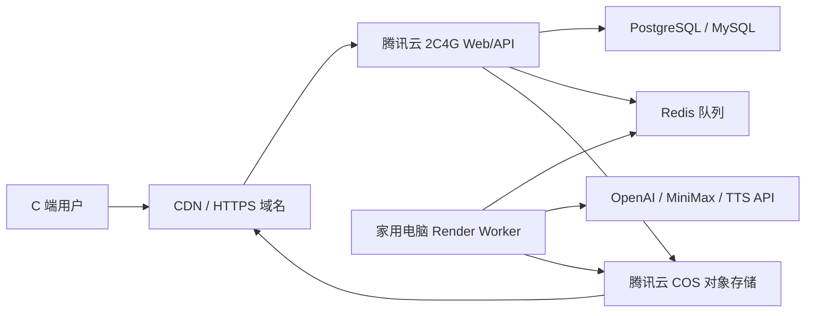

# VideoFactory 混合部署教程：腾讯云入口 + 家用电脑渲染

适用现状：

- 腾讯云服务器：2 核 4G，适合作为公网入口、API、任务状态服务。
- 家用电脑：48 核 64G，适合作为视频渲染 Worker。
- 家庭网络：不建议直接暴露公网端口；优先让家用电脑主动向云端拉任务，或用 Cloudflare Tunnel 做临时/管理入口。

重要边界：当前项目仍是 Next.js 单体、本地 SQLite/JSON 状态、本地 Remotion 渲染队列和本地 `public/generated` 输出。要做到“腾讯云接用户、家里电脑渲染”，代码还需要拆出数据库、队列、对象存储和独立 Worker。本教程先给出完整目标架构和准备步骤，最后列出项目需要改造的功能点。

## 1. 推荐架构



职责划分：

- 腾讯云 Web/API：登录、用户项目、提交任务、查询进度、支付/额度、管理后台。
- Redis 队列：保存待生成任务，避免用户请求直接卡在渲染进程里。
- 数据库：保存用户、项目、视频状态、扣费记录、任务结果。
- 家用电脑 Worker：主动连接云端队列，拉取任务，本地用 Remotion/ffmpeg 渲染。
- COS + CDN：保存并分发 MP4、图片、音频；用户下载不占用家庭宽带。

## 2. 为什么不要让用户直接访问家用电脑

家用电脑算力很强，但家庭网络有这些问题：

- 上行带宽通常小，多个用户下载 MP4 会很快打满。
- 家庭 IP 可能变化，甚至没有公网 IPv4。
- 断电、睡眠、路由器重启都会影响在线率。
- 直接端口映射会暴露家庭网络，安全风险高。

正确用法是：家用电脑只做“出站连接”。它主动连接 Redis/API 拉任务，渲染完成后把文件上传到 COS。用户永远访问腾讯云和 CDN。

## 3. 第一阶段：不用大改代码的测试方案

如果只是少量内部测试，可以先选一个临时方案。

### 方案 A：腾讯云单机跑全部服务

适合验证登录、页面和少量视频生成。

配置建议：

- 腾讯云：2C4G 可以启动网站，但不适合频繁渲染。
- `REMOTION_RENDER_CONCURRENCY=1`
- `REMOTION_RENDER_SCALE=0.5`
- `REMOTION_RENDER_CRF=23`

缺点：2C4G 渲染慢，多个任务会排队很久。

### 方案 B：家用电脑跑完整应用，Cloudflare Tunnel 暴露域名

适合非常早期演示，不适合正式 C 端收费。

优点：

- 不需要公网 IP。
- 不需要路由器端口映射。
- 可以直接利用家里 48 核 CPU。

缺点：

- 用户访问和视频下载都可能占用家庭上行。
- 家用电脑关机/睡眠后服务不可用。
- 大文件分发仍然不适合家庭网络。

Cloudflare Tunnel 官方说明：Tunnel 可以通过 `cloudflared` 主动向 Cloudflare 建立出站连接，不要求本机有公网 IP，也能把公网 hostname 映射到本地服务。

参考：

- Cloudflare Tunnel: https://developers.cloudflare.com/tunnel/
- Cloudflare Tunnel routing: https://developers.cloudflare.com/tunnel/routing/

## 4. 第二阶段：推荐的正式混合部署

正式方案是：腾讯云接用户，家用电脑只做 Worker。

### 4.1 腾讯云服务器准备

建议系统：

- Ubuntu 22.04 LTS 或 24.04 LTS
- 安全组开放：`80`、`443`
- 不开放数据库、Redis 到公网

基础软件：

```bash
sudo apt update
sudo apt install -y git curl nginx ufw
```

防火墙：

```bash
sudo ufw allow OpenSSH
sudo ufw allow 80
sudo ufw allow 443
sudo ufw enable
```

Node 版本要求：

当前项目 `package.json` 要求 Node `>=22 <25`。服务器建议安装 Node 22 LTS 或 Node 24。

部署目录：

```bash
sudo mkdir -p /opt/videofactory
sudo chown -R $USER:$USER /opt/videofactory
cd /opt/videofactory
git clone <你的仓库地址> app
cd app
npm ci
npm run build
```

临时启动：

```bash
npm run start -- -p 3000
```

正式进程管理可用 PM2 或 systemd。PM2 示例：

```bash
npm install -g pm2
pm2 start npm --name videofactory-web -- run start -- -p 3000
pm2 save
pm2 startup
```

Nginx 反向代理：

```nginx
server {
    listen 80;
    server_name app.example.com;

    client_max_body_size 200m;

    location / {
        proxy_pass http://127.0.0.1:3000;
        proxy_http_version 1.1;
        proxy_set_header Host $host;
        proxy_set_header X-Real-IP $remote_addr;
        proxy_set_header X-Forwarded-For $proxy_add_x_forwarded_for;
        proxy_set_header X-Forwarded-Proto $scheme;
        proxy_set_header Upgrade $http_upgrade;
        proxy_set_header Connection "upgrade";
    }
}
```

启用：

```bash
sudo ln -s /etc/nginx/sites-available/videofactory /etc/nginx/sites-enabled/videofactory
sudo nginx -t
sudo systemctl reload nginx
```

HTTPS 可以用 Cloudflare 代理、腾讯云 SSL 证书，或 certbot。正式收费产品必须使用 HTTPS。

### 4.2 数据库

正式 C 端不要继续用 SQLite 做核心生产库。推荐：

- 前期省钱：PostgreSQL 跑在腾讯云 2C4G 上，但要每天备份。
- 更稳：腾讯云 TDSQL-C / 云数据库 MySQL / PostgreSQL 托管版。

最低目标表：

- `users`
- `projects`
- `video_scenes`
- `render_jobs`
- `render_job_events`
- `assets`
- `billing_accounts`
- `credit_ledger`

### 4.3 Redis 队列

Redis 用于任务队列。前期可以和 Web 放同一台腾讯云服务器，后期换托管 Redis。

队列建议：

- `render:waiting`
- `render:active`
- `render:completed`
- `render:failed`

任务字段：

```json
{
  "jobId": "render_job_xxx",
  "projectId": "video_project_xxx",
  "userId": "user_xxx",
  "template": "ai-explainer-short-v1",
  "priority": 5,
  "createdAt": "2026-05-11T00:00:00.000Z"
}
```

### 4.4 腾讯云 COS 对象存储

正式生成的视频、图片、音频不要存在 Web 服务器本地。建议使用腾讯云 COS：

- Bucket：私有读写。
- CDN：绑定独立域名，例如 `media.example.com`。
- Worker：上传 MP4、图片、音频。
- Web：只保存 COS key、文件大小、时长、封面、播放 URL。

腾讯云 COS Node.js SDK 官方快速入门：  
https://cloud.tencent.com/document/product/436/8629

建议目录：

```text
video-factory/
  users/{userId}/projects/{projectId}/output.mp4
  users/{userId}/projects/{projectId}/cover.png
  users/{userId}/projects/{projectId}/subtitles.srt
  users/{userId}/projects/{projectId}/input.json
```

权限建议：

- 创建子账号，不使用主账号密钥。
- 子账号只允许访问指定 COS bucket/prefix。
- 密钥只放在服务器环境变量，不提交到 Git。

### 4.5 家用电脑 Render Worker

家用电脑建议 Windows 也可以继续用，但要做这些设置：

- 关闭自动睡眠。
- 保持电源稳定。
- 安装 Node 22/24。
- 安装 ffmpeg，并加入 PATH。
- 使用有线网络优先。
- 准备本地高速磁盘目录，例如 `D:\VideoFactoryRuntime`。

Worker 环境变量建议：

```powershell
$env:VIDEO_FACTORY_WORKER_TOKEN="一段长随机密钥"
$env:VIDEO_FACTORY_API_BASE="https://app.example.com"
$env:VIDEO_FACTORY_GENERATED_ROOT="D:\VideoFactoryRuntime\generated"
$env:REMOTION_RENDER_CONCURRENCY="2"
$env:REMOTION_RENDER_SCALE="1"
$env:REMOTION_RENDER_CRF="20"
$env:OPENAI_API_KEY="你的文本/图片/TTS API Key"
$env:COS_SECRET_ID="腾讯云 COS 子账号 SecretId"
$env:COS_SECRET_KEY="腾讯云 COS 子账号 SecretKey"
$env:COS_BUCKET="examplebucket-1250000000"
$env:COS_REGION="ap-guangzhou"
```

启动方式，改造完成后应类似：

```powershell
npm run worker:render
```

当前仓库还没有 `worker:render` 脚本，这是后续需要新增的生产化能力。

### 4.6 Cloudflare Tunnel 的用途

混合架构下，家用电脑 Worker 不需要被公网访问。Cloudflare Tunnel 只建议用于：

- 临时演示家用电脑上的完整应用。
- 暴露 Worker 健康检查页面，但必须加访问控制。
- 远程管理，不建议开放给普通用户。

Windows 上的大致流程：

```powershell
cloudflared tunnel login
cloudflared tunnel create videofactory-home
cloudflared tunnel route dns videofactory-home worker-admin.example.com
cloudflared tunnel run videofactory-home
```

配置文件示例：

```yaml
tunnel: <Tunnel-UUID>
credentials-file: C:\Users\Administrator\.cloudflared\<Tunnel-UUID>.json

ingress:
  - hostname: worker-admin.example.com
    service: http://localhost:3100
  - service: http_status:404
```

Cloudflare 官方文档要求 ingress 规则最后有兜底规则，常见写法是 `http_status:404`。

## 5. 项目需要改造的功能清单

当前项目要变成上面的架构，需要做这些代码改造。

### 5.1 数据层

目标：

- 从 SQLite/JSON 切到 PostgreSQL/MySQL。
- 保留本地 JSON 只作为开发模式，不作为生产状态源。

需要改造：

- `lib/db.ts`
- `lib/storage.ts`
- 所有读写 `data/*.json` 的业务模块

### 5.2 渲染队列

目标：

- Web 只创建任务，不在请求进程里渲染。
- Worker 从 Redis 拉任务，执行 Remotion 渲染。
- 渲染进度回写数据库。

需要改造：

- `lib/render-jobs.ts`
- 新增 `worker/render-worker.ts`
- 新增 `npm run worker:render`

### 5.3 文件存储

目标：

- 渲染输出先落本地临时目录。
- Worker 完成后上传 COS。
- Web 播放 COS/CDN URL。

需要改造：

- `lib/remotion-renderer.ts`
- 新增 `lib/providers/tencent-cos.ts`
- `VideoAsset` 需要支持 `storageProvider`、`objectKey`、`publicUrl`、`sizeBytes`。

### 5.4 用户和额度

目标：

- C 端必须限制生成次数、并发、频率和失败重试。

建议规则：

- 免费用户：每日 1-3 条，排队优先级低。
- 付费用户：更多额度，更高优先级。
- 单用户同时运行任务：前期限制 1 个。
- 全站同时渲染任务：由 Worker 数量决定。

### 5.5 安全

必须有：

- HTTPS。
- 登录态安全。
- API rate limit。
- Worker token 鉴权。
- 上传文件大小限制。
- 管理后台权限隔离。
- 生成内容审核/违规拦截。

## 6. 并发和扩容策略

不要按在线人数估算机器，要按“每小时生成多少条视频”估算。

假设：

- 单条视频平均渲染 3 分钟。
- 一个 Worker 同时跑 2 条。
- 家用电脑稳定并发 2 条。

则大约：

```text
60 分钟 / 3 分钟 * 2 并发 = 约 40 条视频/小时
```

如果一天 200 条视频，这台家用电脑足够。  
如果高峰一小时 200 条视频，需要更多 Worker 或云渲染机。

扩容顺序：

1. 限制免费用户并发和每日额度。
2. 增加 Redis 队列和等待时间提示。
3. 家用电脑 Worker 并发从 2 调到 3 或 4，观察失败率。
4. 增加第二台 Worker。
5. 购买云 CPU 渲染机作为备用。
6. 高峰期临时扩容云 Worker，低峰关闭。

## 7. 家庭网络注意事项

家用电脑只上传最终文件到 COS，不给用户直接下载。

估算：

- 单条 MP4 如果 50MB。
- 每天 100 条，只上传到 COS 一次，就是 5GB 上行。
- 如果 100 个用户每人都从家里下载一次，就是 500GB 上行，家庭网络基本扛不住。

所以必须让用户走 COS/CDN。

## 8. 监控指标

上线后每天看这些数据：

- 队列等待数量。
- 平均排队时间。
- 平均渲染时间。
- 渲染失败率。
- 单用户失败次数。
- COS 上传失败率。
- OpenAI/MiniMax/TTS 接口失败率。
- 腾讯云 CPU/内存/磁盘。
- 家用电脑 CPU/内存/磁盘/网络上行。

告警线建议：

- 队列等待超过 30 分钟：限制新免费任务或增加 Worker。
- 渲染失败率超过 5%：暂停扩量，先查模板/ffmpeg/接口错误。
- 家用电脑内存长期超过 85%：降低渲染并发。
- 家庭上行长期超过 80%：降低 Worker 并发或换云 Worker。

## 9. 推荐落地顺序

第一步：腾讯云先跑 Web 版本。

- 配好域名、HTTPS、Nginx、Node。
- 能登录、能创建视频项目。
- 暂时关闭或限制云端渲染。

第二步：接 PostgreSQL/MySQL。

- 用户、项目、任务、资产先迁到数据库。
- SQLite 只留开发模式。

第三步：接 Redis 队列。

- Web 创建任务后立即返回。
- 页面轮询任务状态。

第四步：开发家用电脑 Worker。

- Worker 主动拉任务。
- Worker 渲染并回写进度。
- Worker 上传 COS。

第五步：接 COS/CDN。

- 所有 MP4、图片、音频走对象存储。
- 页面播放 CDN URL。

第六步：做 C 端限制。

- 每用户并发限制。
- 每日额度。
- 失败退款/返还额度。
- 队列等待时间提示。

## 10. 验收标准

完成后，用这 8 条验收：

1. 用户访问 `https://app.example.com` 能注册/登录。
2. 用户提交视频生成后，页面立即显示“排队中”，请求不会长时间卡住。
3. 腾讯云数据库里能看到 `render_job`。
4. 家用电脑 Worker 日志显示接收到同一个 `jobId`。
5. 渲染时家用电脑 CPU 上升，腾讯云 CPU 不被打满。
6. 渲染完成后，COS 出现 `output.mp4`。
7. 用户播放视频时，流量来自 COS/CDN，不来自家用电脑。
8. 家用电脑断网后，新任务只排队，不影响网站登录和浏览。

## 11. 我的建议配置

现在就做：

- 腾讯云 2C4G：Web/API、Nginx、Redis 临时版、轻量数据库或连接托管数据库。
- 家用电脑 48C64G：Worker，先开 `REMOTION_RENDER_CONCURRENCY=2`。
- COS：保存所有生成文件。
- CDN：给用户播放/下载。

不建议现在做：

- 让用户直接访问家里电脑。
- 在腾讯云 2C4G 上同时承载大量 Remotion 渲染。
- 多台 Web 服务器共享 SQLite。
- 把视频文件长期存在服务器本地磁盘。

## 12. 需要准备的信息

后续开始改造代码前，需要确认：

- 域名：例如 `app.example.com`、`media.example.com`。
- 腾讯云服务器系统版本和公网 IP。
- 是否愿意使用腾讯云 COS。
- 数据库选择：托管 PostgreSQL/MySQL，还是先放腾讯云服务器本机。
- Redis 选择：托管 Redis，还是先放腾讯云服务器本机。
- 家用电脑系统：Windows 还是 Linux。
- 预计前期每日视频生成量。
- 单条视频平均时长和清晰度目标。

